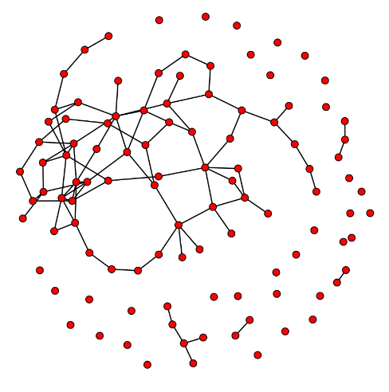
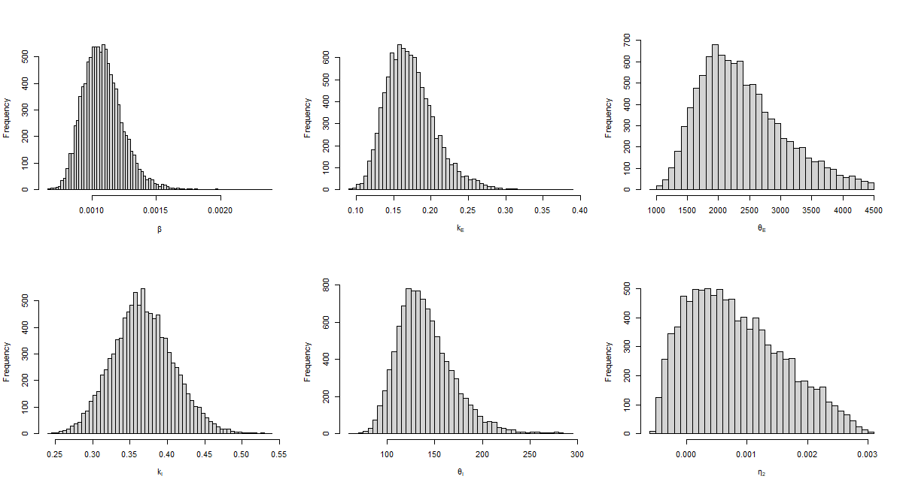
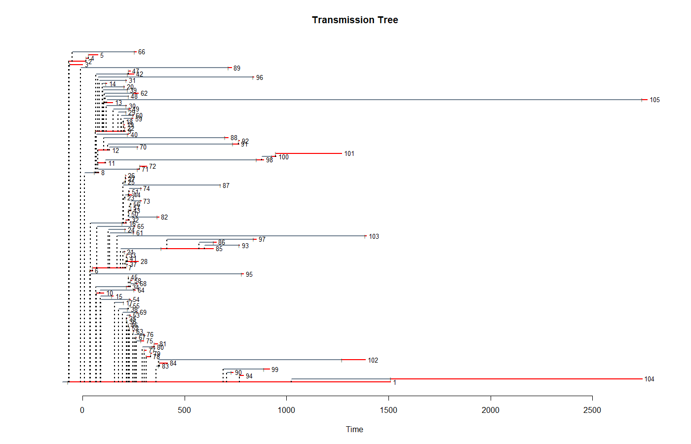

# Simulating Information Spread across Social Network via ERGM and SEIR Model with MCMC

The key idea of this project is to simulate information spread behaviours and user networks on internet social media platform with (disease) transmission model and graph model, and estimate the parameters for transmission using MCMC.

## Background

### Type of the information studied: Help-seeking messages
There are different types of accounts on social media platforms. Compared with those official and verified accounts that have tons of follower, we study help-seeking message posted by ordinary users, for example, a lost-pet poster. These sort of message can be amplified and spread out of the user's (small) friend group to a more general public depends on how important or attractive the original message is. Similar messages includes obscure person's whistleblowing, memes that are made by an ordinary user and go viral or anything that shares the pattern of *an ordinary user's content gets spread out and draws the attention of mass public*. These information spreading behavioiurs share the similarly to the decentralized human-to-human transmission during an epidemic and therefore could be simulated through transmission models.

### Transmission model: The SEIR compartmental model
This is one of the most frequently used mathematical models for infectious diseases. In this model, individuals are separated into four groups: susceptible, exposed, infectious and removed according to their current conditions. Susceptible individuals are those who have not been infected yet but may be infected in the future. After an infectious contact, a susceptible individual will be moved to the exposed group where they are already infected but not yet infectious. After a latency period, the individuals move to the infectious group. Finally, they step into the removed stage when they are no longer infectious nor susceptible to the disease. This process is unidirectional.

There are many variants of the model describing different situations. For example, the SIS model assumes that the infectious individuals gain no immunity and would become susceptible to the disease again once recovered. This can be a proper way to model the transmission of common cold or influenza. In this project, re-infection corresponds to an individual broadcasting the same information twice and is very unlikely to happen. Therefore, individuals will be moved to the removed group eventually once infected.

### Social network model: Dyadic independent exponential family random graph (ERGM)
Since actual social connections are not easy to be observed and recorded directly (in the context of internet social media, this means you can not always get the complete following/follower lists since they can be private), the network structure is estimated based on a natural assumption that people having higher similarities, such as living closer or attending the same class, are more likely to be connected. Dyadic independent exponential family random graph (ERGM) is an effective tool to approximate the contact network under this rule.

The advantage of this subclass of ERGM is that it is easy to be understood, interpreted and computed. Each coefficient can be interpreted as the incremental log odds of the probability of an edge regarding its effect, and the dyadic-independence property makes it possible to implement the MCMC algorithm through the dyads. **However, this property also brings the major shortcoming of this model. In a real-world social network, friends of friends are more likely to be friends and thus is not dyadic independent.** Nevertheless, taking such dyadic-dependent attributes into account will bring too much trouble to computation and model inference.

## Methods

### Computation: Bayesian inference and Markov chain Monte Carlo (MCMC) simulation
To apply this transmission model to a social network structure, the epidemic can be considered as a directed subgraph of which includes all nodes that are infected during the epidemic, and its edges are where transmission occurred. As the process is unidirectional, this subgraph would be a (transmission) tree. Given an initial node, we can now represent the complete process of an epidemic spreading over a fixed social network. Under the Bayesian framework, the joint posterior distribution of the parameters of this model can be estimated by MCMC simulation. See the thesis paper for mathematical details.

### Software: `epinet` package on `R`
This `R` package contains various epidemic/network-related tools. See details at https://cran.r-project.org/web/packages/epinet/index.html

## Data
The dataset is build with web crawled data from a Chinese social media platform, *Weibo*. The reason for this platform selection is that it preserves the complete content forward (repost) path, which can be seen as a transmission tree with the forward time of the post by a user corresponding to the time when an individual becomes infectious. For example, the platform will store the posts in the form “C:repost//@B:repost//@A:original” if C reposts B's repost from A, which is directly the transmission path of user C. On the contrary, Twitter and most of the other mainstream platforms will not show representations of the intermediary reposts when it comes to multi-level retweeting.

*Unfortunately, due to the content policy, the original raw data and the crawling scripts can not be published.*

The chosen message (post) was about a cat trapped in the house and need feeding during the Covid-19 lockdown. The complete data set consists of 105 nodes (users).

### User profile data for simulating social network: `nodcov_filled.csv`
This 105 rows × 9 columns matrix consists of user attributes, including their sex, city, number of posts and followers/followings, user level and check-mark type. The following table is a part of the covariate data. We use these covariances to simualte a social network.

There are 6 missing rows in this dataset due to the fact that some accounts no longer existed when the data were extracted. That may be caused by the users deleting their accounts themselves or being banned from the platform. Such accounts' existences are confirmed through the forward path, but all the attribute parameters and their exact forwarding times are lost. The Missing node IDs are: 9, 17, 33, 48, 63, 100. To solve this, for the social network data, categorical values are assigned with a new class and other numerical parameters are filled with their medians.

### Transmission tree: `Re_est_Time.csv`
etting the user who first posted cat rescue post as the root node and the timestamp of the post as 0, the web crawler scrapes all forwards. From the scarped data, a transmission tree can be constructed. The time that a user $i$ had forwarded the post is considered as the infectious time $I_i$ in the SEIR model, since that is the time when other users could see and repost it again.

All of the removal times are estimated since there is no certain data that can show this directly. Since the transmission is over as the information is spread 2 years ago and is very unlikely to have new forwards, it is reasonable to assume such time exists as the definition of removal is when an infected individual becomes no longer susceptible nor infectious anymore. Therefore, for all the parent nodes, their removal time $R_i$ is assumed to be the infectious time $I_j$ of the lastly infected user $j$ among all of the successors they have, as they no longer infect other nodes after that. However, there are still many nodes with no successors. Nevertheless, the known data of time intervals from the infected to the removal state can already fit an exponential distribution that is used to generate random values for those nodes.

## Results

### Social network visualization
|  | 
|:--:| 
| *The visualization of the social network under estimated network weight eta.* |

According to the social media data, there are about half of the users who reposted the message do not have a direct follow relationship with their parent node. Those users are considered isolated from other users in this social network. Meanwhile, a few users have many followers, resulting in many connections. The rest of the reposts are in a chained manner, that is, the message is passed from one to another. The shown network satisfies these features.

### Transmission parameters' posterior
|  | 
|:--:| 
| *Estimated posterior densities for epidemic parameters beta, k_I, theta_I, k_E, theta_E and eta_2 where eta_2$ represents the absolute difference of follower number.* |

### Simulated transmission tree
The transmission tree provides an intuitive perception of the spreading process. The transmission tree is updated in each iteration of the MCMC algorithm just as other parameters. The following figure is one such example. From the figure we can see that the reposting is highly clustered, that is, there are few parent nodes and those nodes have many successors.
|  | 
|:--:| 
| *An example of the (truncated) sampled transmission tree. The truncation was due to the ill behaviour discussed in the thesis paper. The exposure time of the root node, which is a huge negative number, was cut off from the figure in order to show the detail of the transmission across other nodes.* |

**It is important to emphasize that this figure is only a single sample from the chain. It does not represent the posterior distribution of the transmission tree, and thus should not be over-interpreted.**

## Unsolved issue
The package contains certain bugs that stops the simulation from generating correct results. See Section 6.2 and Appendix C of the thesis paper.

## About
This work is done at [Department of Mathematics](http://www.math.vu.nl/), [Vrije University Amsterdam](https://vu.nl/en) under the supervision of [prof.dr. Meulen, F.H. van der.](https://research.vu.nl/en/persons/frank-van-der-meulen).